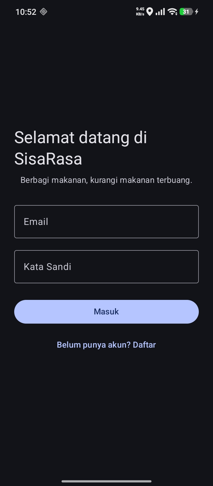
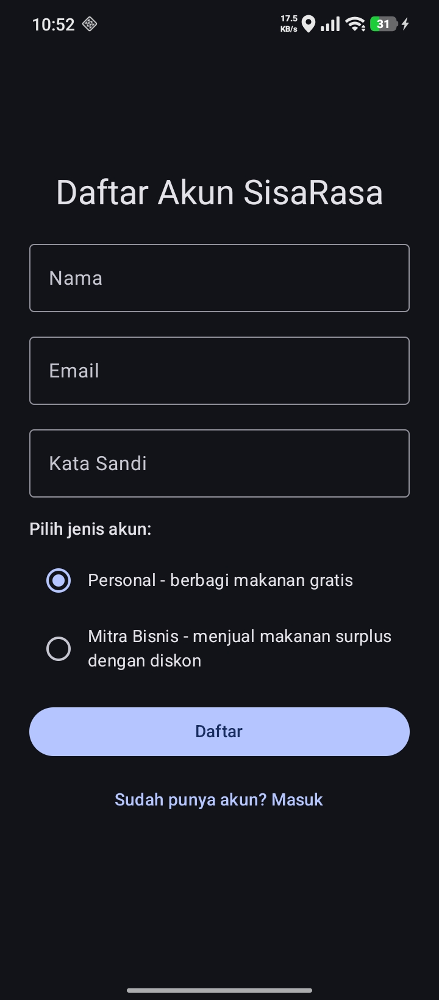
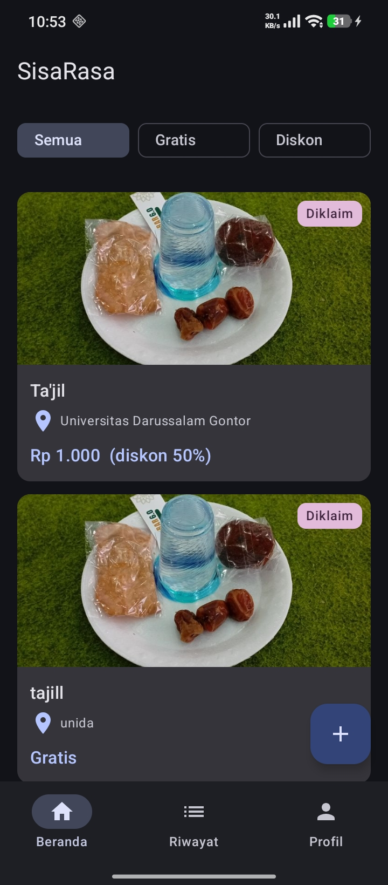
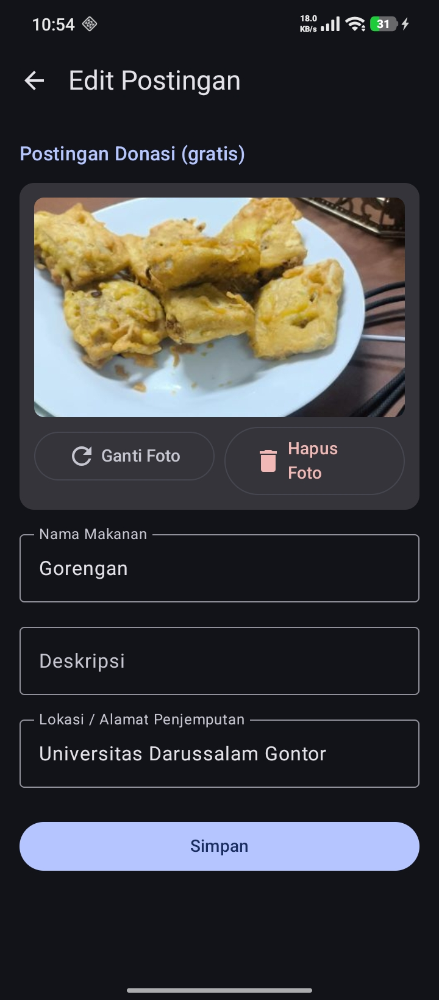
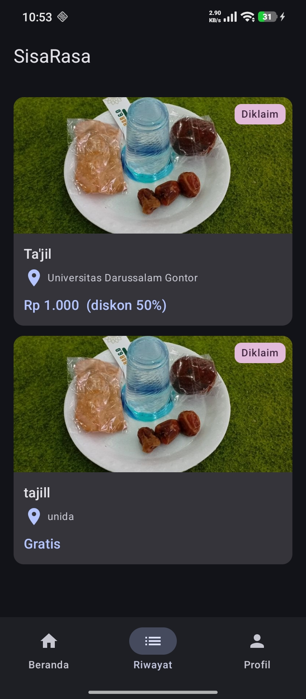

# SisaRasa

SisaRasa is a native Android application built with Kotlin and Jetpack Compose designed to reduce food waste by connecting individuals and business merchants sharing surplus food with recipients.

## Features

- **User Authentication**: Email and password sign-in/registration powered by Firebase Auth, supporting Personal (donors) and Business / Mitra Bisnis (discount surplus sellers) roles.
- **Surplus Food Feed**: Real-time feed filtering posts between Donasi (free surplus food) and Flash Rescue (discounted surplus food).
- **Post CRUD Operations**: Create, edit, and delete food surplus posts with title, description, price, location, and photo attachments.
- **Image Compression & Storage**: Client-side photo compression with upload to Supabase Storage.
- **Location & Map Integration**: Embedded Google Maps view and deep-linking to Google Maps search navigation for pickup locations.
- **Real-Time Inventory & Status**: Synchronized post status updates (Available, Claimed, Sold Out) across devices using Firebase Realtime Database.
- **Claim & History Tracking**: Claiming mechanism for available food items and a dedicated Riwayat (History) tab tracking claimed and completed listings.
- **Hybrid Data Layer**: Operates on live cloud services (Firebase & Supabase) or fully offline using in-memory mock repositories.

## Architecture

The application uses a single-module (`:app`) layered architecture:

- **Domain Layer (`com.mobile.sisarasa.domain`)**
  - Contains core data models (`Post`, `AppUser`, `Location`, `PostType`, `PostStatus`, `UserRole`, `FeedFilter`).
  - Contains pure domain rules and logic (`PostLogic`) for post eligibility, status transitions, and feed filtering.

- **Data Layer (`com.mobile.sisarasa.data`)**
  - Defines repository interfaces (`AuthRepository`, `PostRepository`, `StorageRepository`).
  - **Firebase & Supabase Implementations**: Real-time database sync (`FirebasePostRepository`), authentication (`FirebaseAuthRepository`), and Supabase image uploads (`SupabaseStorageRepository`).
  - **Local Implementations**: In-memory repositories (`LocalAuthRepository`, `LocalPostRepository`, `LocalStorageRepository`) used when backend credentials are not set.

- **UI Layer (`com.mobile.sisarasa.ui`)**
  - Built with Jetpack Compose and Material 3 design components.
  - State management powered by ViewModels (`AuthViewModel`, `HomeViewModel`, `RiwayatViewModel`, `PostDetailViewModel`, `EditPostViewModel`) and Kotlin `StateFlow`.

- **Dependency Injection (`com.mobile.sisarasa.di`)**
  - Manual container (`AppContainer`) providing repository instances based on environment configuration (`BuildConfig`).

## Screenshots

| Login | Register | Feed (Beranda) |
|---|---|---|
|  |  |  |

| Add Post | Edit Post | History (Riwayat) |
|---|---|---|
|  |  |  |

## Prerequisites

- Android Studio (Ladybug 2024.2.1 or newer recommended)
- JDK 11 or JDK 21
- Android SDK (minSdk 24, targetSdk 36, compileSdk 37)

## Setup and Configuration

1. **Clone the repository:**
   ```bash
   git clone <repository-url>
   cd SisaRasa
   ```

2. **Configure project secrets:**
   Copy `secrets.properties.example` to `secrets.properties` in the project root:
   ```bash
   cp secrets.properties.example secrets.properties
   ```

   Fill in your configuration details:
   ```properties
   FIREBASE_ENABLED=true
   FIREBASE_DATABASE_URL=https://<your-database-id>.asia-southeast1.firebasedatabase.app/
   MAPS_API_KEY=<your-google-maps-api-key>
   SUPABASE_URL=https://<your-supabase-project>.supabase.co
   SUPABASE_ANON_KEY=<your-supabase-anon-key>
   ```

3. **Firebase Setup:**
   - Download `google-services.json` from Firebase Console and place it into `app/google-services.json`.
   - Enable **Email/Password** sign-in under Authentication.
   - Create a **Realtime Database** instance and set rules:
     ```json
     {
       "rules": {
         ".read": true,
         ".write": true
       }
     }
     ```

4. **Supabase Setup:**
   - Create a **public** storage bucket named `posts` in your Supabase project.
   - Ensure an `INSERT` policy is allowed for anonymous/authenticated uploads.

## Building and Running

- **Build Debug APK:**
  ```bash
  ./gradlew assembleDebug
  ```

- **Run Unit Tests:**
  ```bash
  ./gradlew testDebugUnitTest
  ```

- **Run Code Linting:**
  ```bash
  ./gradlew lint
  ```

To run the application from Android Studio, open the project, wait for Gradle sync, select a device or emulator running Android 7.0 (API 24) or higher, and click **Run 'app'**.
